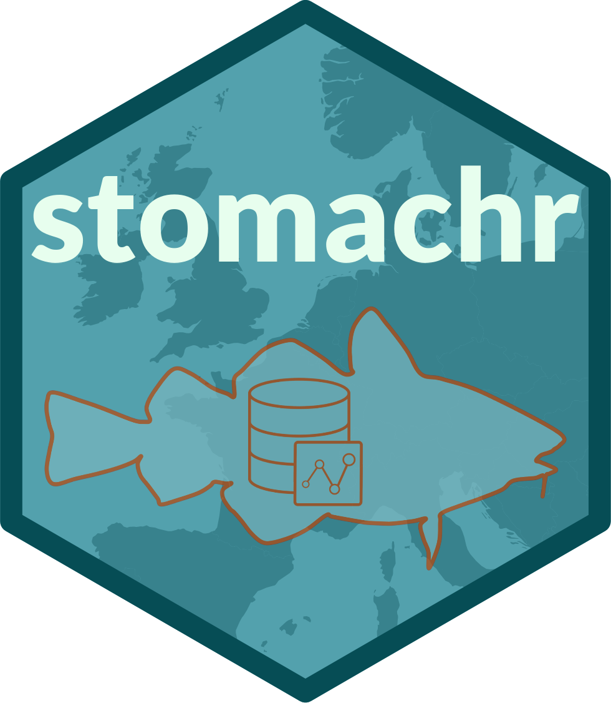

# stomachr 

> Downloading and cleaning ICES stomach content data

<!-- badges: start -->
[](https://github.com/maxlindmark/stomachr/actions/workflows/R-CMD-check.yaml)
[](https://opensource.org/licenses/MIT)
<!-- badges: end -->

stomachr is a package that downloads [ICES stomach content data](https://stomachdata.ices.dk/inventory) and provides tools for merging, enriching, imputing, trimming, quality-checking and filtering stomach data from the ICES stomach database. It's meant to complement the [FishStomachs R package](https://github.com/MortenVinther/FishStomachs), by working directly from the new ICES stomach database and the new format, as well as focusing more the actual data preparation and general use, rather then preparing aggregated stomachs for the SMS model. 

The idea is to lower the threshold to get started with analyzing stomach content data (which can be overwhelming to work with) by presenting a structured and reproducible workflow. Inspired by [tidylog](https://github.com/elbersb/tidylog), it prints clean summaries of each operation, and flags unusual observations so that you easily get an overview of what happens in all processing scripts.

The full pipeline produces a single tibble, with one row per prey record per predator, suitable for analysis of diet composition, food levels, predator-prey mass ratios, and more!

For a full walkthrough of the pipeline and example analyses (diet composition, predator–prey mass ratios, temporal trends), a database coverage/migration status check, a rundown of known data and documentation issues, see the [Articles](https://maxlindmark.github.io/stomachr/articles/index.html), or locally:

```r
vignette("example-workflow", package = "stomachr")
vignette("example-analysis", package = "stomachr")
vignette("database-overview", package = "stomachr")
vignette("known-issues", package = "stomachr")
browseVignettes("stomachr")
```

## Installation

```r
# install.packages("remotes")
remotes::install_github("maxlindmark/stomachr")
```

To also build the vignette locally, change the install command:

```r
remotes::install_github("maxlindmark/stomachr", build_vignettes = TRUE)
```

## Usage

To use the functions in this package for preparing the data, you can either download the data yourself from the [ICES portal](https://stomachdata.ices.dk/inventory) and put them in a designated path. Or you can use the built in `download_stomach` function:

### Download

```r
library(stomachr)

download_stomach(path = "data/raw")
```

Filter by year, country, or ecoregion:

```r
download_stomach(path = "data/raw", year = 2000:2010, country = c("DK", "NO", "SE"))
download_stomach(path = "data/raw", ecoregion = "Greater North Sea")
```

## Data

ICES stomach data come in the new format of four related CSV files:

| File | Description |
|---|---|
| `File_information.csv` | Metadata per submission |
| `HaulInformation.csv` | Haul location and time |
| `PredatorInformation.csv` | Individual predator fish |
| `PreyInformation.csv` | Prey items per stomach |

Species are identified by AphiaID (WoRMS taxonomic identifiers). `stomachr` resolves these to scientific names and higher taxonomy using a bundled lookup table built from the WoRMS API, so that the user do not have to do that.

## Function overview

### Downloading

| Function | Description |
|---|---|
| `download_stomach()` | Download the four ICES stomach content CSVs to a local directory |

### Cleaning pipeline

The key functions of this package, which takes you from the four raw csv to something ready for analysing, are these:

| Function | Description |
|---|---|
| `join_stomach_data()` | Read and join the four CSVs; classify stomach status; impute any missing coordinates from ICES rectangle midpoints |
| `add_taxonomy()` | Join scientific names and higher taxonomy for predators and prey (from the included WoRMS lookup) |
| `unpool_predators()` | Resolve records where `Number > 1` (a "predator" is really a pooled group of that many fish) to one row per implied individual (`method = "uncount"`, default) or drop them (`method = "filter"`). Uncount simply replicates that row `Number-regurgitated` times. That's why it's important this function is run before `drop_invalid()`! Not all individual predators in a pooled record are regurgitated necessarily. For example: a predator record may have `Number = 10` and `regurgitated = 2` (2 stomachs in the "pool"). If `drop_invalid()` is run first, the entire record will get lost, since there are regurgitated stomachs. What unpool_predators does it that it copies the record, distributed prey counts (to keep integer values), and divides prey weights by `Number > 1`. This creates pseudo-individuals. If `regurgitated = 2`, the first two pseudoindividuals are removed in `drop_invalid()`. The other option is to use `method = "filter"`. That simply drops records with `Number > 1`. This may be needed in case you want to look at variance etc. But maybe its better to use uncount if spatiotemporal coverage is important (Norway and early Netherlands data are all pooled). Importantly one of these methods has to be used if you want to look at things like stomach fullness or feeding rate.
| `drop_invalid()` | Remove predators with regurgitated stomach contents |
| `impute_size()` | Estimate missing prey weight and length via L/W parameters (FishBase<sup>1</sup> for fish, Robinson et al. 2010<sup>2</sup> for invertebrates) with hierarchical taxonomic fallback; creates the final `predator_weight` column |
| `trim_data()` | Return only the analysis-ready columns |
| `sense_check()` | Add a `sense_flag` column marking implausible records (prey longer/heavier than predator, stomach heavier than predator, implausible predator lengths, unknown prey counts) for the user to inspect |
| `drop_flagged()` | Remove rows where `sense_flag` is not `NA` |

### Visualisation

| Function | Description |
|---|---|
| `plot_map()` | Plot sampling locations on a North Sea LCC projection, coloured and faceted by any column |

## Data included in the package

| Dataset | Description |
|---|---|
| `worms_lookup` | WoRMS taxonomy for every AphiaID in the ICES database |
| `lw_params` | Length-weight parameters with taxonomic fallback (FishBase for fish; Robinson 2010 for invertebrates) |

The four raw North Sea CSV files (2020-2024) are bundled in `inst/extdata/` and used in `vignette("example-workflow", package = "stomachr")` to demonstrate the full pipeline.

### Clean

A full pipeline may look like this: 

```r
dat <- join_stomach_data("data/raw") |>
  add_taxonomy()|>
  unpool_predators() |>
  drop_invalid() |>
  impute_size() |>
  trim_data() |>
  sense_check() |>
  drop_flagged()
```

## References

<sup>1</sup> Froese, R. and D. Pauly. Editors. 2026. FishBase. World Wide Web electronic publication.
www.fishbase.org, version (02/2026).

<sup>2</sup> Robinson, R.A. et al. (2010). Trophic relationships of marine benthic invertebrates in the North Sea. *Journal of the Marine Biological Association of the United Kingdom*, 90(7), 1375–1388.
