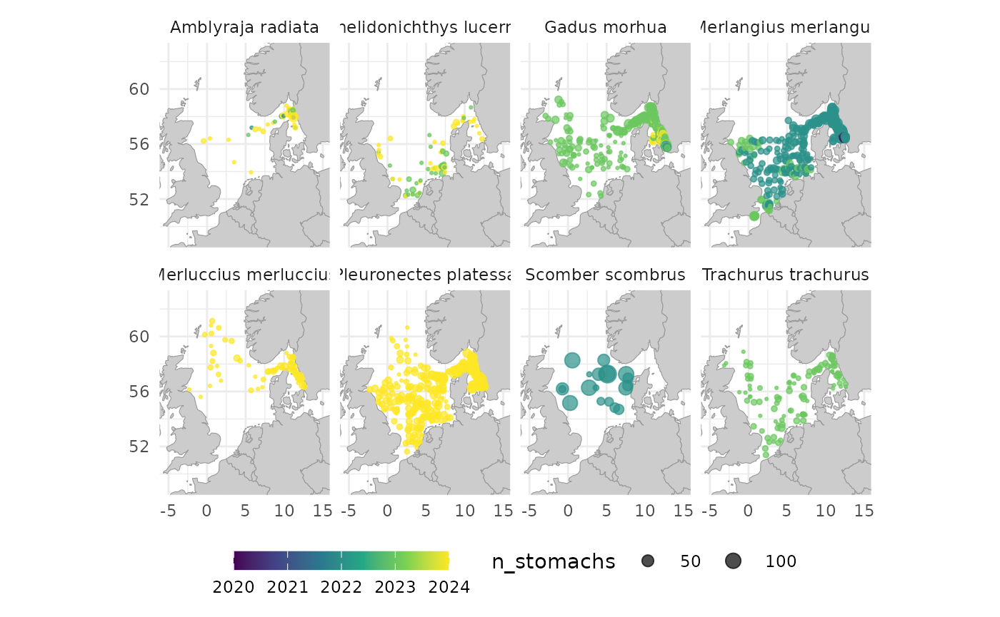
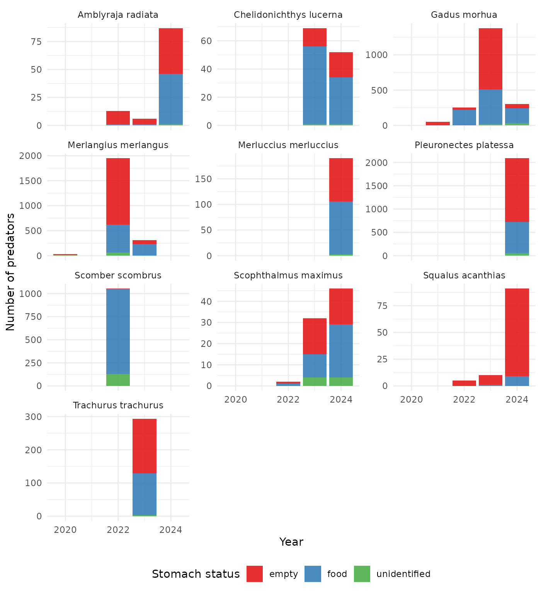
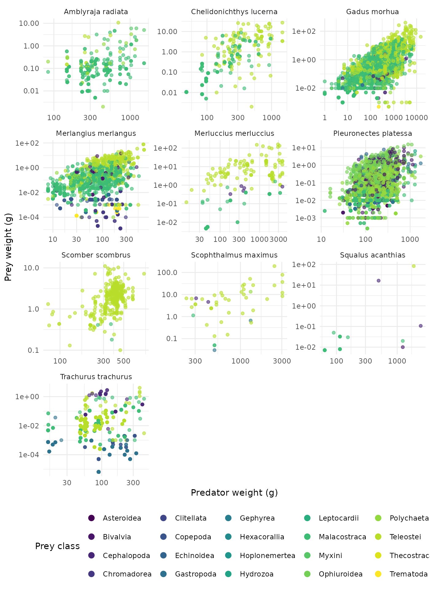
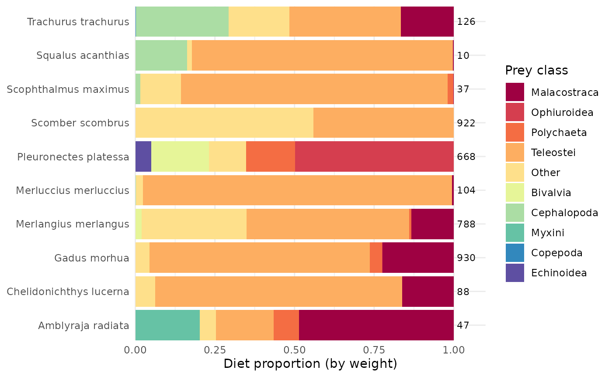
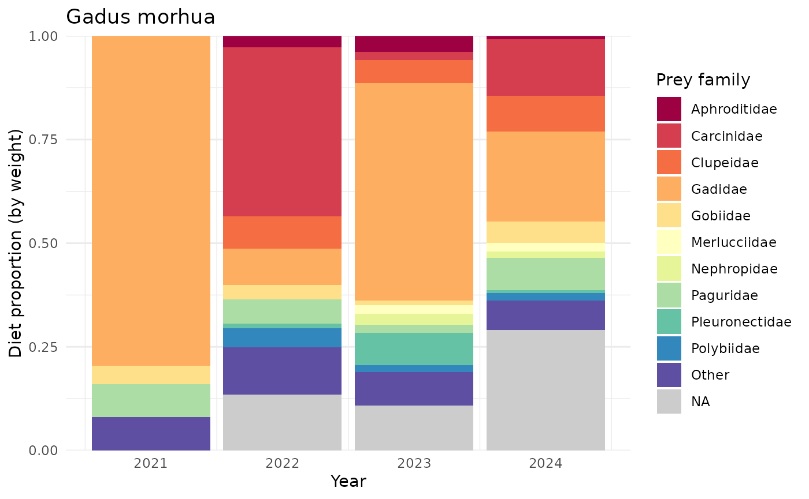

# Example analysis

This vignette picks up where
[`vignette("example-workflow", package = "stomachr")`](https://maxlindmark.github.io/stomachr/articles/example-workflow.md)
leaves off, using the same bundled North Sea data (2020–2024). See that
vignette for what each pipeline step does; here we just reconstruct the
cleaned `dat` in one go and go straight to some example plots.

``` r

library(stomachr)
path <- system.file("extdata", package = "stomachr")
```

``` r

dat <- join_stomach_data(path) |>
  dplyr::mutate(
    pred_length  = dplyr::if_else(country == "BE" | tbl_upload_id == "8337", pred_length / 10, pred_length),
    ind_wgt      = dplyr::if_else(country == "DK", ind_wgt * 1000, ind_wgt),
    regurgitated = dplyr::if_else(tbl_upload_id == "8337", regurgitated - 1, regurgitated),
    number       = dplyr::if_else(country == "NO", 1, number)
  ) |>
  add_taxonomy() |>
  unpool_predators() |>
  drop_invalid() |>
  impute_size() |>
  trim_data() |>
  sense_check() |>
  drop_flagged()
#> Warning: ! There are outliers in predator size compared to a W=0.01*L^3 that indicate
#>   input errors. Check raw data.
#> ℹ 2,705 of 8,886 predator record flagged (|log10(observed weight / predicted
#>   weight)| > 1.5)
#> join_stomach_data(): 8,886 predator individuals
#> ✔ 3,845 (43.3%) with identifiable prey
#> ℹ 4,084 (46.0%) empty or regurgitated
#> ℹ 957 (10.8%) with prey records but no prey species ID
#>   (cannot contribute to diet composition but can contribute to total prey
#>   weight)
#> ℹ 0 haul locations imputed from ICES rectangle midpoint
#>   
#> add_taxonomy(): WoRMS names resolved
#> ✔ Predator AphiaIDs: 23 unique, 0 unresolved
#> ! Prey AphiaIDs: 254 unique, 3 unresolved
#>   
#> drop_invalid(): 8,886 -> 8,559 predators (327 dropped, 3.7%)
#> ℹ regurgitated value >= 1 assumed regurgitated
#> ℹ regurgitated == NA assumed not regurgitated (n = 3,927 kept)
#> ℹ Dropped by country:
#>   country   n percent_of_total
#> 1      BE  18             0.2%
#> 2      DK   6             0.1%
#> 3      NL 114             1.3%
#> 4      NO  30             0.3%
#> 5      SE 159             1.8%
#> 
#> impute_size(): which = "both" | method = "lw_params" | size = "both" |
#> fill_if_no_size = TRUE
#> 
#> Prey: 7,985 records | L/W params (unique AphiaIDs): species: 65, family: 39,
#> order: 30, class: 56, phylum: 16, universal (a=0.01, b=3): 48
#> |-- both weight and length recorded: 1,767 (22.1%)
#> |-- one size recorded, other estimated: 6,099 (76.4%)
#> | |-- had length, estimated weight via L/W: 24 (0.3%)
#> | +-- had weight, estimated length via L/W: 6,075 (76.1%)
#> |-- no size recorded, imputed from other records: 115 (1.4%)
#> | |-- same stomach: mean weight -> length via L/W: 8 (0.1%)
#> | |-- same pred-prey pair: mean weight -> length via L/W: 104 (1.3%)
#> | +-- global species mean: mean weight -> length via L/W: 3 (0.0%)
#> +-- no size info in any record of that species: 4 (0.1%) (diet composition
#> only, weight unusable)
#> 
#> Predator: 13,935 rows | L/W params (unique AphiaIDs): species: 22, family: 1
#> |-- weight and length observed: 13,935 (100.0%)
#> +-- weight observed, length missing: 0 (0.0%)
#>   trim_data(): dropped 32 columns:
#>   ship, gear, haul_no, station_number, fish_id, ind_wgt, measurement_increment,
#>   code, maturity_scale, maturity_stage, preservation_method, stomach_fullness,
#>   full_stom_wgt, empty_stom_wgt, stomach_empty, gen_samp, notes, ident_met,
#>   grav_method, prey_sequence, unit_wgt, weight, unit_lngt, other_items,
#>   other_count, predator_rank, predator_phylum, predator_genus, prey_rank,
#>   prey_phylum, prey_genus, ind_weight_est
#>   sense_check(): 13,935 rows! prey longer than predator (same unit assumed): 1 row (0.0%) across 1 predator
#>   tbl_predator_information_id: 110462! total stomach content heavier than predator: 1 row (0.0%) across 1 predator
#>   tbl_predator_information_id: 110348ℹ 2 rows flagged (0.01%)
#> ℹ Use `drop_flagged()` to remove, or inspect tbl_predator_information_id in raw
#>   data
#>   ✔ drop_flagged(): removed 2 rows (0.01%), 13,933 remaining
#> 
```

The next sections show some basic plots for the most common predators in
the build in North Sea data (2020–2024).

``` r

library(ggplot2)
library(dplyr)
library(tidyr)
library(forcats)
library(scales)

theme_set(theme_minimal())
n <- 10

top <- dat |>
  distinct(tbl_predator_information_id, .keep_all = TRUE) |>
  count(predator_scientific_name, sort = TRUE) |>
  slice_head(n = n) |>
  pull(predator_scientific_name)
```

### Sampling locations

``` r

plot_map(dat, color = "year")
```



### Number of empty, food, and unidentified stomachs by year and predators

For this plot, we use
[`distinct()`](https://dplyr.tidyverse.org/reference/distinct.html) to
get one row per predator, the get the frequency of stomach-statuses
across years and predator species.

``` r

dat |>
  filter(predator_scientific_name %in% top) |>
  distinct(tbl_predator_information_id, .keep_all = TRUE) |>
  count(year, predator_scientific_name, stomach_status) |>
  ggplot(aes(year, n, fill = stomach_status)) +
  geom_col(alpha = 0.9) +
  scale_x_continuous(breaks = \(x) pretty(x, n = 3)) +
  facet_wrap(~predator_scientific_name, ncol = 3, scales = "free_y") +
  scale_fill_brewer(palette = "Set1") +
  theme(legend.position = "bottom") +
  labs(x = "Year", y = "Number of predators", fill = "Stomach status")
```



### Predator-prey mass ratio (PPMR)

To plot predator-prey mass ratios, we can use the final dataset, but we
need to `uncount(count)`, such that one row is one individual prey!

``` r

dat |>
  filter(predator_scientific_name %in% top, stomach_status == "food") |>
  drop_na(predator_weight, prey_weight_ind) |>
  drop_na(prey_class) |>
  uncount(count) |>
  ggplot(aes(predator_weight, prey_weight_ind, color = prey_class)) +
  facet_wrap(~predator_scientific_name, scales = "free", ncol = 3) +
  geom_point(alpha = 0.6) +
  scale_color_viridis_d() +
  scale_x_log10() +
  scale_y_log10() +
  guides(color = guide_legend(override.aes = list(size = 3, alpha = 1))) +
  labs(x = "Predator weight (g)", y = "Prey weight (g)", color = "Prey class") +
  theme(legend.position = "bottom")
```



### Diet composition by prey class

``` r

plot_dat <- dat |>
  filter(
    predator_scientific_name %in% top,
    stomach_status == "food",
    !is.na(prey_weight_all_ind)
  ) |>
  mutate(
    prey_group = fct_lump_n(coalesce(prey_class, "Other"), n = 5, w = prey_weight_all_ind, other_level = "Other"),
    n_pred = n_distinct(tbl_predator_information_id), .by = predator_scientific_name
  ) |>
  summarise(
    total_weight = sum(prey_weight_all_ind),
    n_pred = first(n_pred),
    .by = c(predator_scientific_name, prey_group)
  ) |>
  mutate(frac = total_weight / sum(total_weight), .by = predator_scientific_name)

ggplot(plot_dat, aes(frac, predator_scientific_name, fill = prey_group)) +
  geom_col() +
  geom_text(
    data = distinct(plot_dat, predator_scientific_name, n_pred),
    aes(x = 1.01, y = predator_scientific_name, label = n_pred),
    hjust = 0, inherit.aes = FALSE, size = 3
  ) +
  scale_fill_brewer(palette = "Spectral") +
  scale_x_continuous(limits = c(0, 1.1), expand = c(0, 0)) +
  coord_cartesian(expand = FALSE, clip = "off") +
  labs(x = "Diet proportion (by weight)", y = NULL, fill = "Prey class")
```



### Cod diet over time by prey family

``` r

dat |>
  filter(
    predator_scientific_name == "Gadus morhua",
    stomach_status == "food",
    !is.na(prey_weight_all_ind)
  ) |>
  mutate(prey_group = fct_lump_n(prey_family, n = n, w = prey_weight_all_ind, other_level = "Other")) |>
  summarise(total_weight = sum(prey_weight_all_ind), .by = c(year, prey_group)) |>
  mutate(frac = total_weight / sum(total_weight), .by = year) |>
  ggplot(aes(year, frac, fill = prey_group)) +
  geom_col() +
  scale_fill_brewer(palette = "Spectral", na.value = "grey80") +
  scale_x_continuous(breaks = \(x) pretty(x, n = 6)) +
  scale_y_continuous(expand = c(0, 0)) +
  labs(
    x = "Year", y = "Diet proportion (by weight)", fill = "Prey family",
    title = "Gadus morhua"
  )
```



## References

Froese, R. and D. Pauly (eds.) FishBase. World Wide Web electronic
publication. www.fishbase.org.

Robinson, R.A. et al. (2010). Trophic relationships of marine benthic
invertebrates in the North Sea. *Journal of the Marine Biological
Association of the United Kingdom*, 90(7), 1375-1388.
