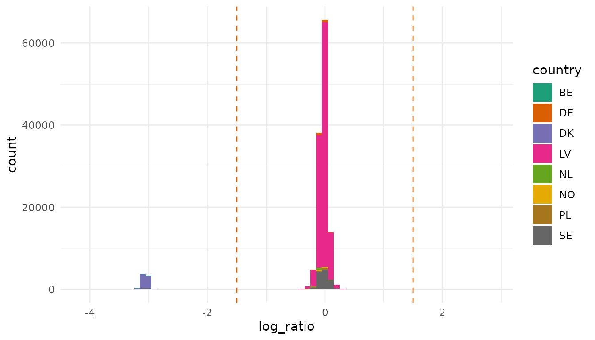
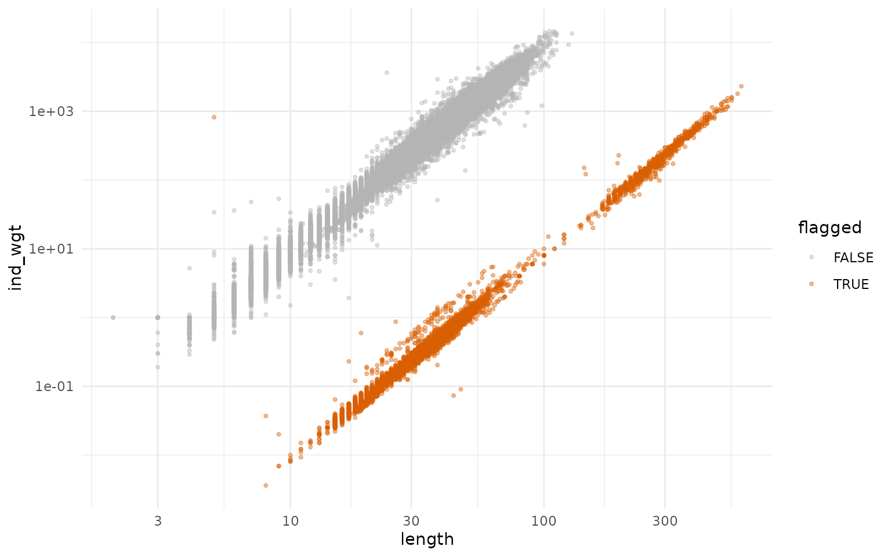
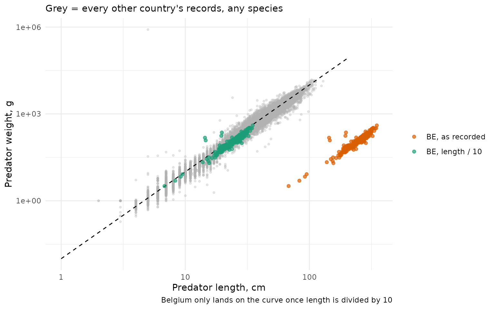
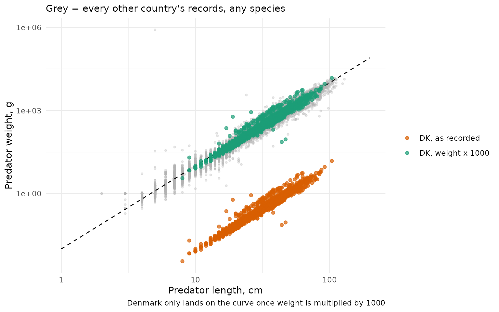
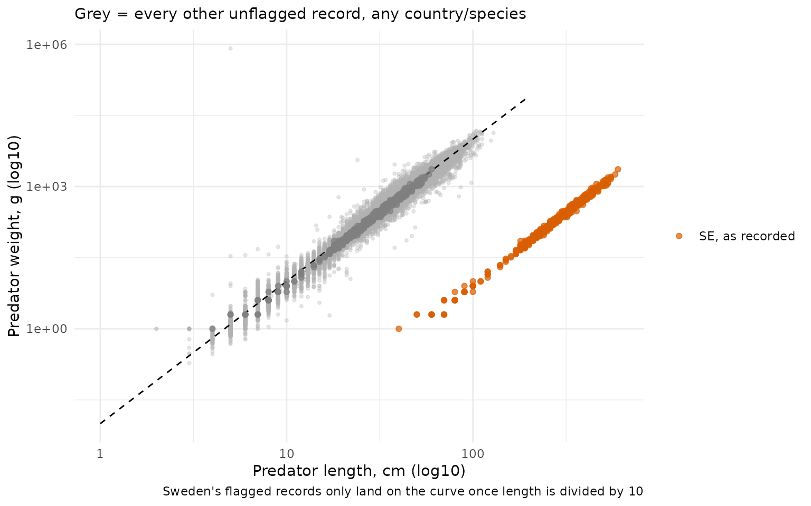
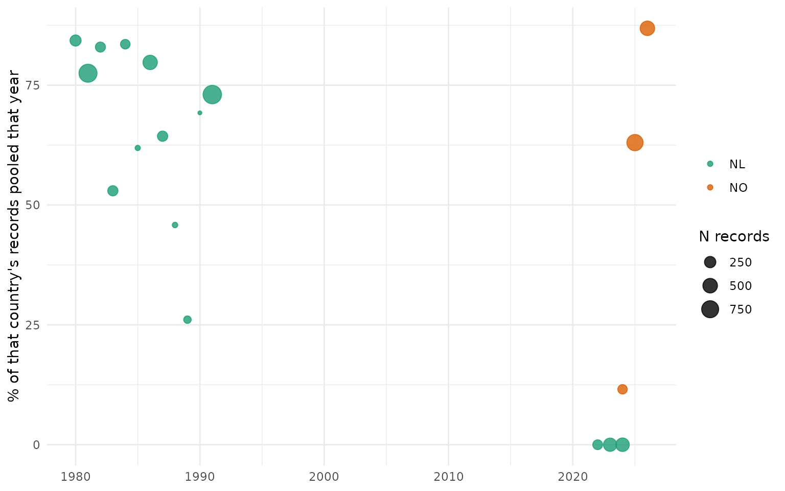
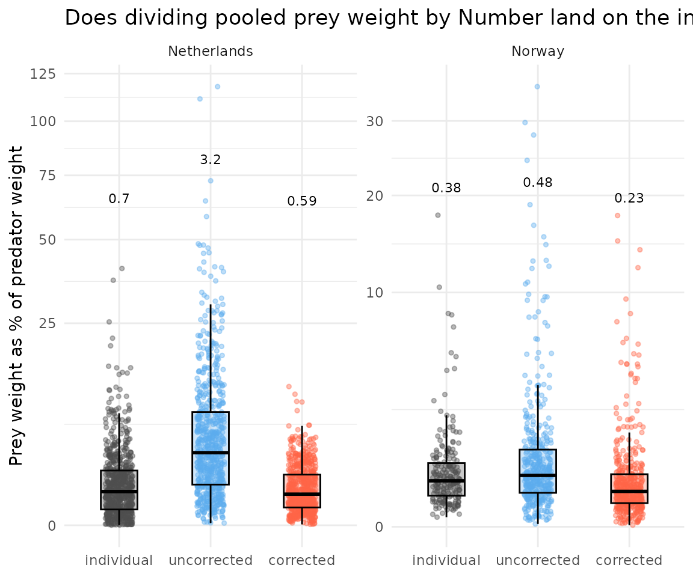
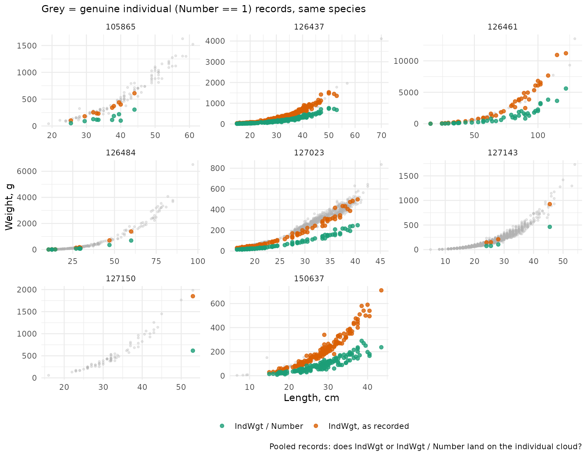
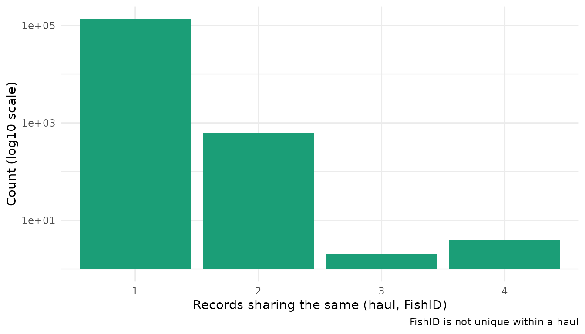
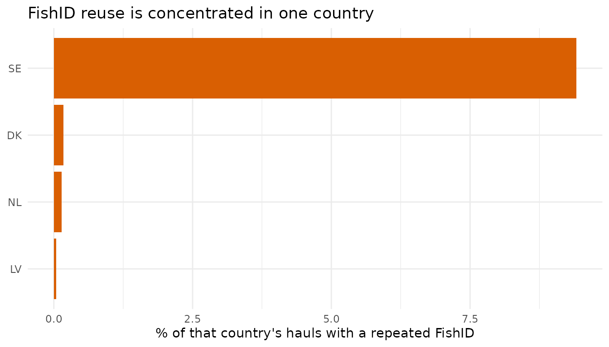

# Known issues

Here I track known issues with the database. These include data entry
errors, which `stomachr` does not fix internally, but show how to fix in
the
[example-workflow](https://maxlindmark.github.io/stomachr/articles/example-workflow.html),
and ambiguities in the [file format
documentation](https://datsu.ices.dk/web/selRep.aspx?Dataset=157) (which
if fixed, can reduce data entry errors).

First download data.

``` r

library(stomachr)
library(dplyr)
library(ggplot2)

theme_set(theme_minimal())

regions <- c("Baltic Sea", "Celtic Seas", "Greater North Sea")

pred <- lapply(regions, function(r) {
  path <- tempfile()
  download_stomach(path, ecoregion = r)

  fi <- readr::read_csv(file.path(path, "File_information.csv"), show_col_types = FALSE) |>
    janitor::clean_names() |>
    transmute(tbl_upload_id = as.character(tbl_upload_id), country = as.character(country))

  prey_n <- readr::read_csv(file.path(path, "PreyInformation.csv"), show_col_types = FALSE) |>
    janitor::clean_names() |>
    transmute(tbl_predator_information_id = as.character(tbl_predator_information_id)) |>
    count(tbl_predator_information_id, name = "n_prey_rows")

  readr::read_csv(file.path(path, "PredatorInformation.csv"), show_col_types = FALSE) |>
    janitor::clean_names() |>
    transmute(
      tbl_upload_id = as.character(tbl_upload_id),
      tbl_predator_information_id = as.character(tbl_predator_information_id),
      tbl_haul_id = as.character(tbl_haul_id),
      fish_id = as.character(fish_id),
      aphia_id_predator = as.numeric(aphia_id_predator),
      number = as.numeric(number),
      measurement_increment = as.numeric(measurement_increment),
      length = as.numeric(length),
      ind_wgt = as.numeric(ind_wgt),
      regurgitated = as.numeric(regurgitated),
      year = as.numeric(year),
      ecoregion = r
    ) |>
    left_join(fi, by = "tbl_upload_id") |>
    left_join(prey_n, by = "tbl_predator_information_id") |>
    mutate(has_prey = !is.na(n_prey_rows) & n_prey_rows > 0)
}) |>
  bind_rows()
#> Warning: One or more parsing issues, call `problems()` on your data frame for details,
#> e.g.:
#>   dat <- vroom(...)
#>   problems(dat)
```

## Known data issues

Units of length and weight of predators. For prey, there are columns
describing which unit it is. For predators, it’s in the description for
`IndWgt` and `Length`. `stomachr` flags extreme outliers in the
[`join_stomach_data()`](https://maxlindmark.github.io/stomachr/reference/join_stomach_data.md),
based on residuals of generic length-weight parameters.

``` r

lw_a <- 0.01
lw_b <- 3

lw_dat <- pred |>
  filter(number == 1, !is.na(length), length > 0, !is.na(ind_wgt), ind_wgt > 0) |>
  mutate(
    log_ratio = log10(ind_wgt / (lw_a * length^lw_b)),
    flagged = abs(log_ratio) > 1.5
  )

lw_curve <- data.frame(length = seq(1, 200, length.out = 200)) |>
  mutate(ind_wgt = lw_a * length^lw_b)
```

Here we see deviations from an isometric length-weight curve
(`weight = a * length^b`, `a = 0.01, b = 3`), per record (usually a
single predator, but can be a pooled predator as well if `number` \> 1).
A record now gets flagged if `abs(log_ratio) > 1.5`.

``` r

lw_dat |>
  ggplot(aes(log_ratio, fill = country)) +
  geom_histogram(binwidth = 0.1) +
  geom_vline(xintercept = c(-1.5, 1.5), linetype = "dashed", color = "#D95F02") +
  scale_fill_brewer(palette = "Dark2")
```



``` r

lw_dat |>
  ggplot(aes(length, ind_wgt, color = flagged)) +
  geom_point(alpha = 0.4, size = 0.8) +
  scale_x_log10() +
  scale_y_log10() +
  scale_color_manual(values = c(`FALSE` = "grey70", `TRUE` = "#D95F02"))
```



``` r

lw_dat |> filter(flagged) |> count(country, sort = TRUE)
#> # A tibble: 4 × 2
#>   country     n
#>   <chr>   <int>
#> 1 DK       6904
#> 2 SE        624
#> 3 BE        242
#> 4 LV          3
```

We don’t know yet whether a flagged record’s `length` or `ind_wgt` is
the wrong one. Length is easier to work with. Assuming all countries do
the same error (doesn’t have to be though), we can see if a length
“correction” leads to implausible lengths (if length varies between 10
and 100, it cannot be in mm because we never collect 1 cm fish. The
similar test is harder to make for weight).

``` r

call_by_record <- lw_dat |>
  filter(flagged) |>
  mutate(call = if_else(length / 10 < 5, "weight", "length"))

call_by_country <- call_by_record |>
  count(country, call) |>
  slice_max(n, by = country) |>
  select(country, call)

lw_dat_corrected <- lw_dat |>
  left_join(call_by_country, by = "country") |>
  mutate(
    length = if_else(flagged & call == "length", length / 10, length),
    ind_wgt = if_else(flagged & call == "weight", ind_wgt * 1000, ind_wgt)
  )
```

Now look at the corrected records:

### 1. Belgium: predator length recorded in mm, not cm

``` r

be_ref <- lw_dat_corrected |> filter(country != "BE")
be_points <- bind_rows(
  lw_dat |> filter(country == "BE") |> mutate(group = "BE, as recorded"),
  lw_dat |> filter(country == "BE", flagged) |> mutate(length = length / 10, group = "BE, length / 10")
)

ggplot() +
  geom_point(data = be_ref, aes(length, ind_wgt), color = "grey70", alpha = 0.3, size = 0.8) +
  geom_line(data = lw_curve, aes(length, ind_wgt), linetype = "dashed", linewidth = 0.5) +
  geom_point(data = be_points, aes(length, ind_wgt, color = group), alpha = 0.7) +
  scale_x_log10() +
  scale_y_log10() +
  scale_color_manual(values = c("BE, as recorded" = "#D95F02", "BE, length / 10" = "#1B9E77")) +
  labs(
    x = "Predator length, cm", y = "Predator weight, g", color = NULL,
    caption = "Belgium only lands on the curve once length is divided by 10",
    subtitle = "Grey = every other country's records, any species"
  )
```



- **Fix applied in the example vignettes**:
  `pred_length = if_else(country == "BE", pred_length / 10, pred_length)`.

### 2. Denmark: predator weight recorded in kg, not g

``` r

dk_ref <- lw_dat_corrected |> filter(country != "DK")
dk_points <- bind_rows(
  lw_dat |> filter(country == "DK") |> mutate(group = "DK, as recorded"),
  lw_dat |> filter(country == "DK", flagged) |> mutate(ind_wgt = ind_wgt * 1000, group = "DK, weight x 1000")
)

ggplot() +
  geom_point(data = dk_ref, aes(length, ind_wgt), color = "grey70", alpha = 0.3, size = 0.8) +
  geom_line(data = lw_curve, aes(length, ind_wgt), linetype = "dashed", linewidth = 0.5) +
  geom_point(data = dk_points, aes(length, ind_wgt, color = group), alpha = 0.7) +
  scale_x_log10() +
  scale_y_log10() +
  scale_color_manual(values = c("DK, as recorded" = "#D95F02", "DK, weight x 1000" = "#1B9E77")) +
  labs(
    x = "Predator length, cm", y = "Predator weight, g", color = NULL,
    caption = "Denmark only lands on the curve once weight is multiplied by 1000",
    subtitle = "Grey = every other country's records, any species"
  )
```



- **Fix applied in the example vignettes**:
  `ind_wgt = if_else(country == "DK", ind_wgt * 1000, ind_wgt)`.

### 3. Sweden: predator length recorded in mm, not cm (\*one upload only)

``` r

se_ref <- lw_dat_corrected |> filter(!(country == "SE" & flagged))
se_points <- bind_rows(
  lw_dat |> filter(country == "SE", flagged) |> mutate(group = "SE, as recorded"),
  lw_dat |> filter(country == "SE", flagged) |> mutate(length = length / 10, group = "SE, length / 10")
)

ggplot() +
  geom_point(data = se_ref, aes(length, ind_wgt), color = "grey70", alpha = 0.3, size = 0.8) +
  geom_line(data = lw_curve, aes(length, ind_wgt), linetype = "dashed", linewidth = 0.5) +
  geom_point(data = se_points, aes(length, ind_wgt, color = group), alpha = 0.7) +
  scale_x_log10() +
  scale_y_log10() +
  scale_color_manual(values = c("SE, as recorded" = "#D95F02", "flagged SE, length / 10" = "#1B9E77")) +
  labs(
    x = "Predator length, cm (log10)", y = "Predator weight, g (log10)", color = NULL,
    caption = "Sweden's flagged records only land on the curve once length is divided by 10",
    subtitle = "Grey = every other unflagged record, any country/species"
  )
```



- Only `country == "SE" & flagged` is affected. Note! In contrast to BE
  and DK, this is limited to a single upload (`tbl_upload_id == "8337"`,
  cod, Baltic Sea), not for all submissions by the country.
- **Fix applied in the example vignettes**:
  `pred_length = if_else(country == "BE" | tbl_upload_id == "8337", pred_length / 10, pred_length)`,
  same line as the Belgium fix above, since both are the same
  length-in-mm issue.

### 4. Sweden: `Regurgitated` sometimes uses a legacy code, not a count

This is a tricky one.

After consultation with ICES stomach analysts directly, the normal
convention seem to be that `0`/`NA` = not regurgitated, `1` =
regurgitated. This does not match the
[instructions](https://datsu.ices.dk/web/selRep.aspx?Dataset=157), which
says: “Number of stomachs regurgitated”, i.e., a count. Nor does it
match the old version in Sweden’s national database, where `1` = intact,
`2` = regurgitated.

Hence, a `1` in Sweden could therefore mean that it was regurgitated (if
the new convention is used), or that it was not regurgitated (old
Swedish convention). `2` in a Swedish record could mean 2 regurgitated
stomachs (i.e., against convention, but in line with the actual
instructions), **but only if** the record is a pooled record. *However*,
Sweden does not normally report pooled stomachs. We can see that’s not
the case here, because even if records with `2` from Sweden did refer to
the correct input of number of regurgitated stomachs, then this number
should never exceed the value in `number`. A better test is this: if the
old code is used, then there should be no zeroes in the `tbl_upload_id`,
which if the new code is used (under whichever interpretation of it),
should be very unlikely!

(There are other issues with regurgitation, see below.)

``` r

# Regurgitated is a count out of Number (ICES: "Number of stomachs regurgitated")
# So Regurgitated > Number is not impossible unless a different code is in use.
pred |>
  filter(!is.na(regurgitated), !is.na(number), regurgitated > number) |>
  count(tbl_upload_id, country)
#> # A tibble: 1 × 3
#>   tbl_upload_id country     n
#>   <chr>         <chr>   <int>
#> 1 8337          SE          4

pred |>
  filter(country == "SE") |>
  summarise(n = n(), .by = c(tbl_upload_id, regurgitated)) |>
  summarise(has_zero = any(regurgitated == 0, na.rm = TRUE), .by = tbl_upload_id) |>
  filter(!has_zero)
#> # A tibble: 1 × 2
#>   tbl_upload_id has_zero
#>   <chr>         <lgl>   
#> 1 8337          FALSE
```

- **Fix applied in the example vignettes**:
  `regurgitated = dplyr::if_else(tbl_upload_id == "8337", regurgitated - 1, regurgitated)`

### 5. Corrupted `ICESrectangle` codes (handled automatically, no manual fix needed)

Some submissions (seen in Celtic Seas data) have corrupt `ICESrectangle`
codes – e.g. `"46E9"` stored as `"46000000000"`, as if a spreadsheet
read it as scientific notation before export. Unlike everything else in
this section,
[`join_stomach_data()`](https://maxlindmark.github.io/stomachr/reference/join_stomach_data.md)
already handles this on its own: it detects codes that don’t match the
real `##L#` format and recomputes them from `ShootLat`/`ShootLong`,
printing how many rows were affected.

``` r

valid_rect <- "^[0-9]{2}[A-Za-z][0-9]$"

rect_dat <- lapply(regions, function(r) {
  path <- tempfile()
  download_stomach(path, ecoregion = r)
  readr::read_csv(file.path(path, "HaulInformation.csv"),
    col_types = readr::cols(ICESrectangle = readr::col_character()), show_col_types = FALSE
  ) |>
    janitor::clean_names() |>
    transmute(ices_rectangle = ice_srectangle, ecoregion = r)
}) |>
  bind_rows()
#> Warning: One or more parsing issues, call `problems()` on your data frame for details,
#> e.g.:
#>   dat <- vroom(...)
#>   problems(dat)

rect_dat |>
  filter(!is.na(ices_rectangle), !grepl(valid_rect, ices_rectangle)) |>
  count(ices_rectangle, sort = TRUE)
#> # A tibble: 20 × 2
#>    ices_rectangle     n
#>    <chr>          <int>
#>  1 51                39
#>  2 4800000000        23
#>  3 5100000000        16
#>  4 52                16
#>  5 51000000000       14
#>  6 490000000         13
#>  7 5000000000        13
#>  8 460000000         10
#>  9 480000000          9
#> 10 500000000          7
#> 11 520                7
#> 12 48000000           6
#> 13 49000000           5
#> 14 46000000           4
#> 15 52000000000        4
#> 16 470000000          2
#> 17 480000             2
#> 18 4900000000         2
#> 19 510                2
#> 20 47000000           1
```

- Malformed codes are consistently long, all-numeric strings – the
  scientific-notation signature – not random corruption.
- **No fix needed here beyond what’s already in**
  [`join_stomach_data()`](https://maxlindmark.github.io/stomachr/reference/join_stomach_data.md);
  included for completeness, since every other entry in this section
  needs a manual workaround and this one doesn’t.

### 6. Norway: `Number` is populated, but the record isn’t actually pooled

`Number` can be greater than `1`, and the [file format
documentation](https://datsu.ices.dk/web/selRep.aspx?Dataset=157)
describes it as “Number of specimens taken for stomach analyses (pooled
samples)” – i.e. that record’s prey rows *should* describe `Number` fish
pooled together for all `n = number` predators that row corresponds to.
It’s unclear what the column `IndWgt` corresponds to when `Number` \> 1

#### Which countries pool?

``` r

pool_dat <- lapply(regions, function(r) {
  path <- tempfile()
  download_stomach(path, ecoregion = r)
  fi <- readr::read_csv(file.path(path, "File_information.csv"), show_col_types = FALSE) |>
    janitor::clean_names() |>
    transmute(tbl_upload_id = as.character(tbl_upload_id), country = as.character(country))
  readr::read_csv(file.path(path, "PredatorInformation.csv"), show_col_types = FALSE) |>
    janitor::clean_names() |>
    transmute(tbl_upload_id = as.character(tbl_upload_id), number = as.numeric(number), year = as.numeric(year)) |>
    left_join(fi, by = "tbl_upload_id")
}) |>
  bind_rows() |>
  filter(!is.na(number), !is.na(year))

pool_dat |>
  summarise(n = n(), pct_pooled = 100 * mean(number > 1), .by = c(country, year)) |>
  mutate(pooled = ifelse(pct_pooled == 0, "Not pooled", "pooled")) |>
  mutate(sum = sum(pct_pooled), .by = c(country)) |> 
  filter(sum > 0) |> 
  ggplot(aes(year, pct_pooled, size = n, color = country)) +
  geom_point(alpha = 0.8) +
  scale_color_brewer(palette = "Dark2") +
  labs(x = NULL, y = "% of that country's records pooled that year", size = "N records", color = NULL)
```



- Only Norway and the Netherlands ever report `Number > 1`
- The Netherlands phased it out: ~74% of its 1980s-90s records were
  pooled, 0% in its 2020s submissions.
- Norway’s only data here is 2020s, still ~66% has `Number > 1`.

#### Does dividing prey weight by `Number` help, or hurt?

A pooled record means that 1 row is not 1 individuals. Getting this
right is crucial for calculating relative prey weight/stomach fullness.

Here I illustrate this by comparing
`total prey weight / predator weight` for records where we know 1 row =
1 individual (`Number == 1`), against pooled records left alone
(“uncorrected”) by row, and pooled records with prey weight divided by
`Number` (“corrected”), one point per predator.

Another insight here: Norway has `IndWgt` on its pooled records; the
Netherlands doesn’t (0 of 2,475 rows), so the Netherlands version uses
the same universal length-weight curve from earlier (`a = 0.01, b = 3`)
as the size reference instead. This is also a clue that Norway’s number
column may be mis-reported…

Every group below (individual, uncorrected, corrected) is restricted to
the same set of species per country: those with *both* `Number == 1` and
`Number > 1` records. Otherwise a species that’s always pooled (or
always individual) for that country would pull a whole group’s ratios up
or down for reasons that have nothing to do with pooling – e.g. if the
pooled species just happen to eat less on average, that would look like
“pooling deflates the ratio” even with no pooling artefact at all.

``` r

prey_dat <- lapply(regions, function(r) {
  path <- tempfile()
  download_stomach(path, ecoregion = r)
  join_stomach_data(path) |>
    summarise(
      total_prey_weight = sum(weight, na.rm = TRUE),
      any_weight = any(!is.na(weight)),
      number = dplyr::first(number),
      ind_wgt = dplyr::first(ind_wgt),
      length = dplyr::first(pred_length),
      country = dplyr::first(country),
      aphia_id_predator = dplyr::first(aphia_id_predator),
      .by = tbl_predator_information_id
    )
}) |>
  bind_rows() |>
  filter(!is.na(number), any_weight, total_prey_weight > 0)
#> Warning: One or more parsing issues, call `problems()` on your data frame for details,
#> e.g.:
#>   dat <- vroom(...)
#>   problems(dat)
#> Warning: ! There are outliers in predator size compared to a W=0.01*L^3 that indicate
#>   input errors. Check raw data.
#> ℹ 4,678 of 123,407 predator record flagged (|log10(observed weight / predicted
#>   weight)| > 1.5)
#> Warning: ! There are outliers in predator size compared to a W=0.01*L^3 that indicate
#>   input errors. Check raw data.
#> ℹ 3,095 of 10,366 predator record flagged (|log10(observed weight / predicted
#>   weight)| > 1.5)
```

``` r

lw_a <- 0.01
lw_b <- 3

no_dat <- prey_dat |> filter(country == "NO", !is.na(ind_wgt), ind_wgt > 0)
no_pooled_species <- no_dat |> filter(number > 1) |> distinct(aphia_id_predator) |> pull()
no_indiv_species <- no_dat |> filter(number == 1) |> distinct(aphia_id_predator) |> pull()
no_species <- intersect(no_pooled_species, no_indiv_species)

nl_dat <- prey_dat |> filter(country == "NL", !is.na(length), length > 0) |>
  mutate(pred_wgt_from_length = lw_a * length^lw_b)
nl_pooled_species <- nl_dat |> filter(number > 1) |> distinct(aphia_id_predator) |> pull()
nl_indiv_species <- nl_dat |> filter(number == 1) |> distinct(aphia_id_predator) |> pull()
nl_species <- intersect(nl_pooled_species, nl_indiv_species)

# Restrict every group to aphia_id_predator %in% no_species/nl_species -- species
# with BOTH individual and pooled records for that country. Without this, a
# species that's e.g. always pooled (never recorded as number == 1) would
# contribute to the "pooled" boxes with no individual counterpart to compare
# against, and the country-level comparison would really be comparing two
# different sets of species, not the same species measured two ways.
ratio_dat_raw <- bind_rows(
  no_dat |> filter(number == 1, aphia_id_predator %in% no_species) |> mutate(country = "Norway", group = "individual", ratio = total_prey_weight / ind_wgt),
  no_dat |> filter(number > 1, aphia_id_predator %in% no_species) |> mutate(country = "Norway", group = "pooled, uncorrected", ratio = total_prey_weight / ind_wgt),
  no_dat |> filter(number > 1, aphia_id_predator %in% no_species) |> mutate(country = "Norway", group = "pooled, corrected (/ Number)", ratio = (total_prey_weight / number) / ind_wgt),
  nl_dat |> filter(number == 1, aphia_id_predator %in% nl_species) |> mutate(country = "Netherlands", group = "individual", ratio = total_prey_weight / pred_wgt_from_length),
  nl_dat |> filter(number > 1, aphia_id_predator %in% nl_species) |> mutate(country = "Netherlands", group = "pooled, uncorrected", ratio = total_prey_weight / pred_wgt_from_length),
  nl_dat |> filter(number > 1, aphia_id_predator %in% nl_species) |> mutate(country = "Netherlands", group = "pooled, corrected (/ Number)", ratio = (total_prey_weight / number) / pred_wgt_from_length)
)
```

``` r

ratio_raw <- ratio_dat_raw |>
  mutate(
    group_clean = dplyr::case_match(
      group,
      "individual" ~ "individual",
      "pooled, uncorrected" ~ "uncorrected",
      "pooled, corrected (/ Number)" ~ "corrected"
    ),
    group_clean = factor(group_clean, levels = c("individual", "uncorrected", "corrected"))
  )

ggplot(ratio_raw, aes(x = group_clean, y = ratio*100, color = group_clean)) +
  geom_jitter(position = position_jitter(width = 0.15, seed = 42), alpha = 0.4, size = 1) +
  geom_boxplot(aes(fill = group_clean), width = 0.4, alpha = 0.3, outlier.shape = NA, color = "black") +
  stat_summary(
    fun = median, geom = "text", color = "black", size = 3, vjust = -30,
    aes(label = signif(after_stat(y), 2))
  ) +
  scale_color_manual(values = c(individual = "grey30", corrected = "tomato", uncorrected = "steelblue2")) +
  scale_fill_manual(values = c(individual = "grey30", corrected = "tomato", uncorrected = "steelblue2")) +
  scale_y_continuous(trans = "sqrt") +
  facet_wrap(~country, scales = "free_y") +
  labs(
    x = NULL, y = "Prey weight as % of predator weight",
    title = "Does dividing pooled prey weight by Number land on the individual baseline?"
  ) +
  theme(legend.position = "none")
```



For the Netherlands (left): “corrected” lands is to “individual”, while
“uncorrected” is off by several-fold. Here number really is the number
of fish pooled together. For Norway (right), “uncorrected” are more
similar to “individual” than “corrected” does, but the uncorrected are
for some reason slightly larger than the individual still. Dividing by
`Number` however makes the difference between “individual” bigger.

#### `Regurgitated`/`StomachEmpty`: capped at 1 for Norway, scales up for the Netherlands

Lastly, to really check Norway here, if a row really is one fish,
`Regurgitated` should never exceed 1 one fish can’t have more than one
regurgitated stomach.

``` r

bind_rows(
  pred |> filter(country == "NO", number > 1) |> mutate(check = "Norway, Number > 1"),
  pred |> filter(country == "NL", number > 1) |> mutate(check = "Netherlands, Number > 1")
) |>
  summarise(
    n = n(),
    max_regurgitated = max(regurgitated, na.rm = TRUE),
    n_regurgitated_gt_1 = sum(regurgitated > 1, na.rm = TRUE),
    .by = check
  )
#> # A tibble: 2 × 4
#>   check                       n max_regurgitated n_regurgitated_gt_1
#>   <chr>                   <int>            <dbl>               <int>
#> 1 Norway, Number > 1        868                1                   0
#> 2 Netherlands, Number > 1  2475               45                 613
```

Norway: `Regurgitated` never exceeds 1, this is consistent with one fish
per row. The Netherlands: it does exceed 1.

``` r

pred |>
  filter(country %in% c("NL", "NO"), number > 1, !is.na(regurgitated)) |>
  ggplot(aes(number, regurgitated)) +
  facet_wrap(~country) +
  geom_abline(slope = 1, intercept = 0, linetype = "dashed", color = "grey50") +
  geom_jitter(width = 0.3, height = 0.3, alpha = 0.4, size = 1) +
  labs(
    x = "Number", y = "Regurgitated",
    caption = "Regurgitated scales with Number in NL, not NO, as a real pooled count should",
    subtitle = "Dashed line = Regurgitated == Number (the upper bound for a genuine count)"
  )
```

Finally, let’s check predator weights. If pooled, unclear what the
`IndWgt` refers to.

``` r

# lw_dat_corrected, not lw_dat: same reasoning as be_ref/dk_ref above -- if
# BE or DK happen to share a species with Norway's pooled records, their
# uncorrected values would otherwise contaminate this reference cloud too.
indiv_ref <- lw_dat_corrected |>
  add_count(aphia_id_predator, name = "n_indiv") |>
  filter(n_indiv >= 30)

pooled_species <- pred |>
  filter(number > 1, !is.na(ind_wgt), !is.na(length), ind_wgt > 0, length > 0) |>
  distinct(aphia_id_predator) |>
  inner_join(indiv_ref |> distinct(aphia_id_predator), by = "aphia_id_predator") |>
  pull(aphia_id_predator)

pooled <- pred |>
  filter(
    number > 1, !is.na(ind_wgt), !is.na(length), ind_wgt > 0, length > 0,
    aphia_id_predator %in% pooled_species
  )

cat("Countries contributing pooled records with a populated IndWgt:", 
    paste(unique(pooled$country), collapse = ", "), "\n")
#> Countries contributing pooled records with a populated IndWgt: NO

pooled_points <- bind_rows(
  pooled |> mutate(plot_wgt = ind_wgt, assumption = "IndWgt, as recorded"),
  pooled |> mutate(plot_wgt = ind_wgt / number, assumption = "IndWgt / Number")
)

ggplot() +
  geom_point(
    data = indiv_ref |> filter(aphia_id_predator %in% pooled_species),
    aes(length, ind_wgt), color = "grey70", alpha = 0.3, size = 0.8
  ) +
  geom_point(data = pooled_points, 
             aes(length, plot_wgt, color = assumption), alpha = 0.8, size = 1.6) +
  facet_wrap(~aphia_id_predator, scales = "free") +
  scale_color_manual(values = c(
    "IndWgt, as recorded" = "#D95F02", "IndWgt / Number" = "#1B9E77")) +
  labs(
    x = "Length, cm", y = "Weight, g", color = NULL,
    caption = "Pooled records: does IndWgt or IndWgt / Number land on the individual cloud?",
    subtitle = "Grey = genuine individual (Number == 1) records, same species"
  ) +
  theme(legend.position = "bottom")
```



**What this means**: - **Netherlands**: genuine pooling, matching the
ICES description. `IndWgt` is never populated (nothing to report for a
pooled group), `Regurgitated`/`StomachEmpty` scale with `Number` as real
counts, and dividing prey weight by `Number` recovers a per-fish rate
that matches genuine individuals. - **Norway**: not pooling. Each row is
one individually-measured fish, indicated by `IndWgt` being populated
and matching up with a single individual, `Regurgitated`/`StomachEmpty`
are capped at 0/1 like any single-fish record, and dividing prey weight
by `Number` makes the per-fish rate *worse*, not better. This really
suggests its a data entry error. - **Fix applied in the example
vignettes**: `number = dplyr::if_else(country == "NO", 1, number)`. This
keeps Norway’s already-one-fish-per-row records untouched by
[`unpool_predators()`](https://maxlindmark.github.io/stomachr/reference/unpool_predators.md),
which after this fix only ever expands genuine Netherlands pooling.

## Limitations in the ICES format documentation

Field descriptions are from
[datsu.ices.dk/web/selRep.aspx?Dataset=157](https://datsu.ices.dk/web/selRep.aspx?Dataset=157)
(Stomach Content dataset, Predator Information record), current as of
2026-08-20.

### 1. `Number`: says “species”, almost certainly means “specimens”

- *“Number of **species** taken for stomach analyses (pooled samples)”*.
- A record has exactly one unique `AphiaIDPredator`, so there’s nothing
  for “number of species” to count within one record.
- **Correction**: “number of **specimens**”
- See also the error above

``` r

# every record has exactly one AphiaIDPredator, regardless of Number,
# confirming "species" can't be the intended plural here
pred |>
  filter(!is.na(aphia_id_predator)) |>
  summarise(
    n_records = n(),
    max_species_per_record = 1L, # AphiaIDPredator is a scalar column by construction
    n_pooled_records = sum(number > 1, na.rm = TRUE),
    pct_pooled = round(100 * n_pooled_records / n_records, 1)
  )
#> # A tibble: 1 × 4
#>   n_records max_species_per_record n_pooled_records pct_pooled
#>       <int>                  <int>            <int>      <dbl>
#> 1    138023                      1             3343        2.4
```

### 2. `FishID`: described as “unique”, but isn’t

- *“**Unique** fish identification number for predator.”*
- **Wrong as written**: up to 4 different predator records can share an
  identical `FishID` within the same unique haul.

``` r

fishid_reuse <- pred |>
  filter(!is.na(fish_id)) |>
  count(tbl_haul_id, fish_id, name = "n_records_sharing_id")

cat(
  "n predator records:", nrow(pred), "\n",
  "n distinct FishID (global):", n_distinct(pred$fish_id), "\n",
  "(haul, FishID) combinations shared by >1 record:", sum(fishid_reuse$n_records_sharing_id > 1), "\n"
)
#> n predator records: 138023 
#>  n distinct FishID (global): 13415 
#>  (haul, FishID) combinations shared by >1 record: 632

fishid_reuse |>
  count(n_records_sharing_id) |>
  ggplot(aes(x = factor(n_records_sharing_id), y = n)) +
  geom_col(fill = "#1B9E77") +
  scale_y_log10() +
  labs(
    x = "Records sharing the same (haul, FishID)", y = "Count (log10 scale)",
    caption = "FishID is not unique within a haul"
  )
```



``` r

# Confirm the duplicated FishID groups are still made of genuinely separate
# records: tblPredatorInformationID (the real row key) must stay distinct.
dup_groups <- fishid_reuse |> filter(n_records_sharing_id > 1)

pred |>
  inner_join(dup_groups, by = c("tbl_haul_id", "fish_id")) |>
  summarise(
    n_records = n(),
    n_distinct_pred_id = n_distinct(tbl_predator_information_id),
    .by = c(tbl_haul_id, fish_id)
  ) |>
  count(n_records, n_distinct_pred_id)
#> # A tibble: 3 × 3
#>   n_records n_distinct_pred_id     n
#>       <int>              <int> <int>
#> 1         2                  2   626
#> 2         3                  3     2
#> 3         4                  4     4
```

- **Not duplicate rows**: `n_records == n_distinct_pred_id` every time.
  `tblPredatorInformationID` (the real row key) stays distinct. It’s
  specifically `FishID` that fails to be unique.

``` r

dup_hauls_by_country <- pred |>
  inner_join(dup_groups, by = c("tbl_haul_id", "fish_id")) |>
  distinct(tbl_haul_id, country) |>
  count(country, name = "n_dup_hauls")

haul_totals <- pred |> distinct(tbl_haul_id, country) |> count(country, name = "n_hauls")

dup_hauls_by_country |>
  left_join(haul_totals, by = "country") |>
  mutate(pct_hauls_affected = 100 * n_dup_hauls / n_hauls) |>
  ggplot(aes(x = reorder(country, pct_hauls_affected), y = pct_hauls_affected)) +
  geom_col(fill = "#D95F02") +
  coord_flip() +
  labs(
    x = NULL, y = "% of that country's hauls with a repeated FishID",
    title = "FishID reuse is concentrated in one country"
  )
```



- **Not spread evenly**: Sweden = 622 of 632 duplicated groups (98%);
  every other affected country (NL, DK, LV) is well under 1% of its own
  hauls.
- **96% of Sweden’s own hauls** have a repeated `FishID`. Suggests a
  reporting pattern.
- **Correction**: Note sure. This column is not critical (we rely on
  `tblPredatorInformationID`), but should be corrected and clarified
  what the column means.

### 3. `Length` and `IndWgt`: undocumented for pooled records (when `Number > 1`)

- For `Number == 1`, both fields are unambiguous: the length/weight of
  that one fish. But the unit of length should be in the header, now it
  says “Length of specimen”. The head for weight has this: “Weight of
  predator in grams”.
- For a pooled record, ICES says nothing about what either value
  represents:
  - `Length` (*“Length of specimen … has to be specified in cm”*). How
    is this number calculated when there are multiple fish?
  - `IndWgt` (*“Weight of predator in grams”*) is this total across all
    `Number` fish, or one representative fish? Well, only Norway fills
    this with `Number` \> 1, and we’ve shown the mis-reported the
    `Number` field. If it its clarified that this is individual predator
    weight/length, maybe this wouldn’t happen.

### 4. `Regurgitated` and `StomachEmpty`: inconsistent wording, and it’s easy to mistake for a binary flag (and may be in practice to treat as binary?!)

- `StomachEmpty`: *“Number of empty stomachs **in the sample**”*.
- `Regurgitated`: *“Number of stomachs regurgitated”* (no “in the
  sample”). This is mainly a wording inconsistency.
- Both are counts relative to `Number`, consistent with `Number`’s own
  “(pooled samples)” note. It’s worth stating explicitly, since the
  convention among many analysts seems to be that `Regurgitated` is a
  0/1 flag rather than a count. Could it be that countries that **do
  not** upload pooled stomachs treat it as a binary? It doesn’t really
  matter if all they do is upload non-pooled stomachs. But it helps
  understand the columns, and make the
  [`unpool_predators()`](https://maxlindmark.github.io/stomachr/reference/unpool_predators.md)
  function in this package easier to understand (where we create
  pseudo-individuals and remove as many as are regurgitated).

## Open question: should a regurgitated stomach have prey content at all?

It’s also worth asking why a truly regurgitated stomach would ever reach
species-level identification in the first place. Speaking to onboard
samplers, if a stomach is visibly regurgitated, a new predator is
selected. Many fish in this data are classified as regurgitated, but
still have prey contents… Typically the issue with regurgitated stomachs
is that we cannot separate them from truly empty stomachs.
