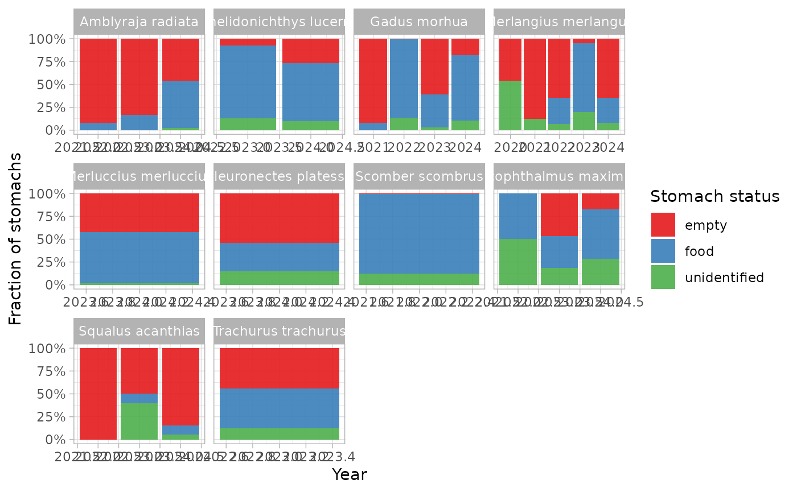
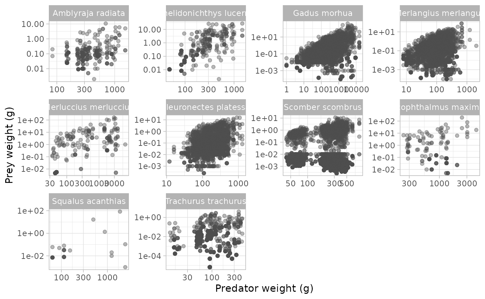
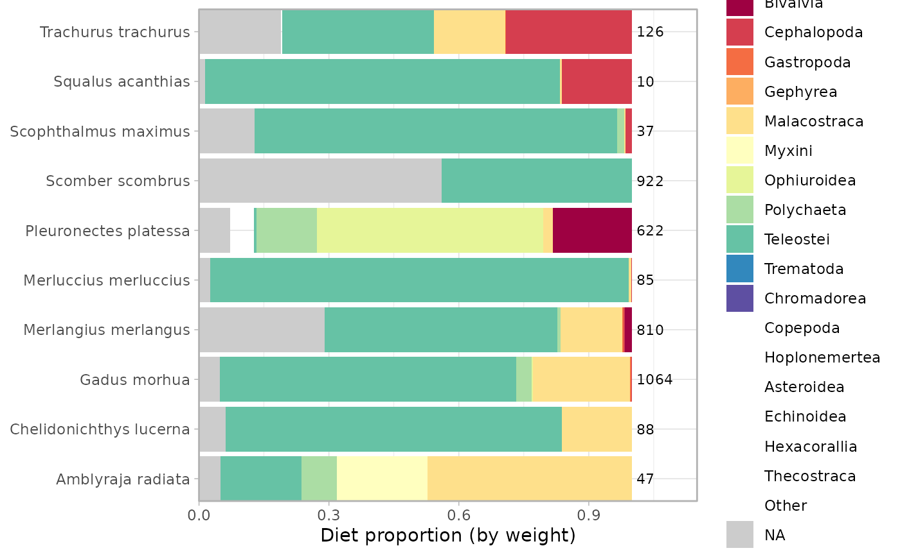
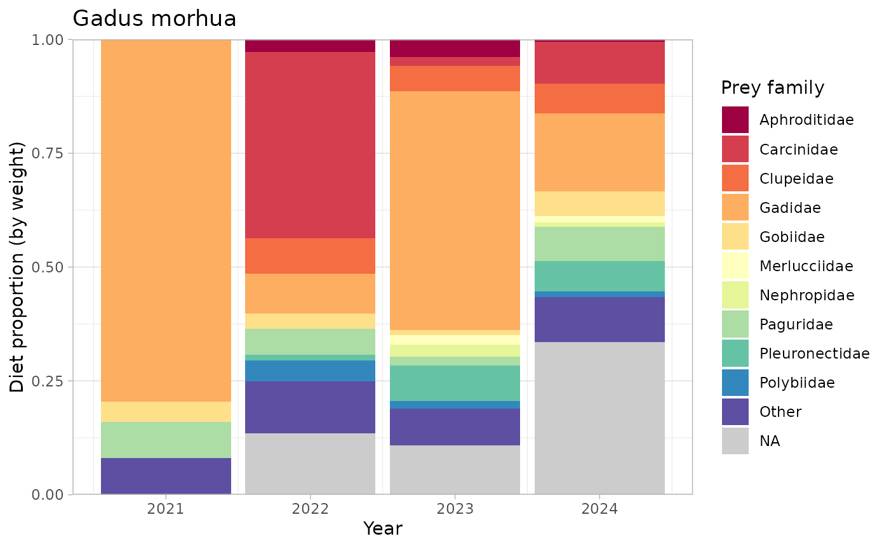

# Getting started with stomachr

`stomachr` provides a tidy pipeline for downloading, reading, cleaning,
and preparing ICES stomach content data for various diet analysis. The
data come from the [ICES stomach content
database](https://stomachdata.ices.dk) and follow the new four-table
exchange format, joined by `tblUploadID`, `tblHaulID`, and
`tblPredatorInformationID`.

## Installation

``` r

# install.packages("remotes")
remotes::install_github("maxlindmark/stomachr")
```

## Workflow

### Step 1: Download

You can download the data from the portal and go to Step 2. Or you can
call
[`download_stomach()`](https://maxlindmark.github.io/stomachr/reference/download_stomach.md),
which downloads data from the ICES API and writes the four CSVs to a
local directory (which you control via `path`). Ecoregion filtering is
not supported by the API (nor in the actual data it seems!), but you can
filter geographically after joining using `lat`/`lon` or
`ices_rectangle`.

``` r

path <- "data/raw"
download_stomach(path)
```

To restrict to specific years or countries:

``` r

download_stomach(path, year = 2000:2010, country = c("DK", "NO", "SE"))
```

In this vignette we run the pipeline on the raw CSVs for the North Sea
(2015-2024) bundled with the package in `inst/extdata/`, as if you had
downloaded them yourself.

``` r

library(stomachr)
path <- system.file("extdata", package = "stomachr")
```

### Step 2: `join_stomach_data()`

The next step is to join the four CSVs. This means attaching haul and
file metadata to predators, classifying each stomach as `"food"`,
`"empty"`, or `"unidentified"`, deduplicates exact-duplicate prey rows
(present in some national submissions), converts prey length from mm to
cm, handles the count sentinel value (9999 = unknown multiplicity), and
optionally imputes missing coordinates from ICES rectangle midpoints
(defaults to yes).

**Known country-specific unit issues** (currently requires manual
correction before proceeding):

- Belgium (`BE`): `pred_length` is in mm – divide by 10
- Denmark (`DK`): `ind_wgt` is in kg – multiply by 1000

``` r

dat <- join_stomach_data(path)
#> join_stomach_data(): 9275 predator individuals
#> ✔ 3932 with identifiable prey
#> ℹ 4253 empty or regurgitated
#> ℹ 1090 with prey records but no prey species ID
#>   (cannot contribute to diet composition but can contribute to total prey
#>   weight)
#> ℹ 0 haul locations imputed from ICES rectangle midpoint

dat <- dat |>
  dplyr::mutate(
    pred_length = dplyr::if_else(country == "BE", pred_length / 10, pred_length),
    ind_wgt     = dplyr::if_else(country == "DK", ind_wgt * 1000, ind_wgt)
  )
```

### Step 3: `drop_invalid()`

Removes predators with `regurgitated >= 1`. Stomach contents of
regurgitated fish are techically not usable. The `na_regurgitated`
argument controls whether `NA` values are treated as not regurgitated
(`"keep"`, default) or regurgitated (`"drop"`).

``` r

dat <- drop_invalid(dat, na_regurgitated = "keep")
#> drop_invalid(): 9275 -> 8988 predators (287 dropped, 3.1%)
#> ℹ regurgitated >= 1 assumed regurgitated
#> ℹ regurgitated == NA assumed not regurgitated (n = 4427 kept)
#> ℹ Dropped by country:
#>   country   n percent_of_total
#> 1      BE   7             0.1%
#> 2      DK   7             0.1%
#> 3      NL 114             1.2%
#> 4      SE 159             1.7%
```

### Step 4: `add_taxonomy()`

Joins scientific names and higher taxonomy (class, order, family,
phylum) for both predators and prey from the internal WoRMS lookup. Prey
with `aphia_id_prey = NA` in non-empty stomachs are labelled `"Unknown"`
so their weight is not silently lost.

``` r

dat <- add_taxonomy(dat)
#> add_taxonomy(): WoRMS names resolved
#> ✔ Predator AphiaIDs: 23 unique, 0 unresolved
#> ✔ Prey AphiaIDs: 252 unique, 0 unresolved
```

### Step 5: `impute_size()`

Estimates missing prey weight and/or length via L/W parameters or
observed means, and estimates missing predator weight from length. Also
creates the final `predator_weight` column (observed weight if
available, otherwise estimated from length). L/W parameters are looked
up from the internal table (FishBase for fish, Robinson 2010 for
invertebrates) with hierarchical fallback: species -\> family -\> order
-\> class -\> phylum -\> universal (a = 0.01, b = 3).

- `which`: impute `"prey"`, `"pred"`, or `"both"` (default)
- `method`: `"lw_params"` (default) uses the bundled L/W table;
  `"observations"` uses mean sizes from other records of the same
  species
- `size`: impute `"weight"`, `"length"`, or `"both"` (default)
- `fill_if_no_size`: if `TRUE` (default), prey with no recorded size
  borrow from other records of the same species before applying L/W

``` r

dat <- impute_size(dat, which = "both", method = "lw_params", size = "both")
#> impute_size(): which = "both" | method = "lw_params" | size = "both" |
#> fill_if_no_size = TRUE
#> Prey: 8169 records | L/W params (unique AphiaIDs): species: 64, family: 40,
#> order: 31, class: 57, phylum: 16, universal (a=0.01, b=3): 44
#> |-- both weight and length recorded: 1871 (22.9%)
#> |-- one size recorded, other estimated: 6207 (76.0%)
#> | |-- had length, estimated weight via L/W: 21 (0.3%)
#> | +-- had weight, estimated length via L/W: 6186 (75.7%)
#> |-- no size recorded, imputed from other records: 88 (1.1%)
#> | |-- same stomach: mean weight -> length via L/W: 8 (0.1%)
#> | |-- same pred-prey pair: mean weight -> length via L/W: 77 (0.9%)
#> | +-- global species mean: mean weight -> length via L/W: 3 (0.0%)
#> +-- no size info in any record of that species: 3 (0.0%) (diet composition
#> only, weight unusable)
#> Predator: 14562 rows | L/W params (unique AphiaIDs): species: 22, family: 1
#> |-- weight and length observed: 14562 (100.0%)
#> +-- weight observed, length missing: 0 (0.0%)
```

### Step 6: `trim_data()`

Returns only the analysis-ready columns.

``` r

dat <- trim_data(dat)
#> trim_data(): dropped 33 columns:
#>   ship, gear, haul_no, station_number, fish_id, ind_wgt, number,
#>   measurement_increment, code, maturity_scale, maturity_stage,
#>   preservation_method, stomach_fullness, full_stom_wgt, empty_stom_wgt,
#>   stomach_empty, gen_samp, notes, ident_met, grav_method, prey_sequence,
#>   unit_wgt, weight, unit_lngt, other_items, other_count, predator_rank,
#>   predator_phylum, predator_genus, prey_rank, prey_phylum, prey_genus,
#>   ind_weight_est
```

### Steps 7-8: `sense_check()` and `drop_flagged()`

[`sense_check()`](https://maxlindmark.github.io/stomachr/reference/sense_check.md)
adds a `sense_flag` column marking implausible records.
[`drop_flagged()`](https://maxlindmark.github.io/stomachr/reference/drop_flagged.md)
removes them. You can inspect flagged records before dropping by
examining `tbl_predator_information_id` in the raw data.

``` r

dat <- sense_check(dat)
#> sense_check(): 14562 rows
#> ! total stomach content heavier than predator: 1 row (0.0%) across 1 predator
#>   tbl_predator_information_id: 110348
#> ℹ 1 row flagged (0.01%)
#> ℹ Use `drop_flagged()` to remove, or inspect tbl_predator_information_id in raw
#>   data
dat <- drop_flagged(dat)
#> ✔ drop_flagged(): removed 1 row (0.01%), 14561 remaining
```

## Example analyses

``` r

library(ggplot2)
library(dplyr)
library(tidyr)
library(forcats)
library(scales)

theme_set(theme_light())
n <- 10

top <- dat |>
  distinct(tbl_predator_information_id, .keep_all = TRUE) |>
  count(predator_scientific_name, sort = TRUE) |>
  slice_head(n = n) |>
  pull(predator_scientific_name)
```

### Proportion of empty, food, and unidentified stomachs by year

``` r

dat |>
  filter(predator_scientific_name %in% top) |>
  distinct(tbl_predator_information_id, .keep_all = TRUE) |>
  count(year, predator_scientific_name, stomach_status) |>
  mutate(frac = n / sum(n), .by = c(year, predator_scientific_name)) |>
  ggplot(aes(year, frac, fill = stomach_status)) +
  geom_col(alpha = 0.9) +
  scale_x_continuous(breaks = \(x) pretty(x, n = 6)) +
  facet_wrap(~predator_scientific_name, scales = "free_x") +
  scale_y_continuous(labels = percent) +
  scale_fill_brewer(palette = "Set1") +
  labs(x = "Year", y = "Fraction of stomachs", fill = "Stomach status")
```



### Predator-prey mass ratio (PPMR)

``` r

dat |>
  filter(predator_scientific_name %in% top, stomach_status == "food") |>
  drop_na(predator_weight, prey_weight_ind) |>
  uncount(count) |>
  ggplot(aes(predator_weight, prey_weight_ind)) +
  facet_wrap(~predator_scientific_name, scales = "free") +
  geom_point(alpha = 0.4, color = "grey30") +
  scale_x_log10() +
  scale_y_log10() +
  labs(x = "Predator weight (g)", y = "Prey weight (g)")
```



### Diet composition by prey class

``` r

plot_dat <- dat |>
  filter(
    predator_scientific_name %in% top,
    stomach_status == "food",
    !is.na(prey_weight_all_ind)
  ) |>
  mutate(
    prey_group = fct_lump_n(prey_class, n = n, w = prey_weight_all_ind, other_level = "Other"),
    n_pred = n_distinct(tbl_predator_information_id), .by = predator_scientific_name
  ) |>
  summarise(
    total_weight = sum(prey_weight_all_ind),
    n_pred = first(n_pred),
    .by = c(predator_scientific_name, prey_group)
  ) |>
  mutate(frac = total_weight / sum(total_weight), .by = predator_scientific_name)

ggplot(plot_dat, aes(frac, predator_scientific_name, fill = prey_group)) +
  geom_col() +
  geom_text(
    data = distinct(plot_dat, predator_scientific_name, n_pred),
    aes(x = 1.01, y = predator_scientific_name, label = n_pred),
    hjust = 0, inherit.aes = FALSE, size = 3
  ) +
  scale_fill_brewer(palette = "Spectral", na.value = "grey80") +
  scale_x_continuous(limits = c(0, 1.15), expand = c(0, 0)) +
  coord_cartesian(expand = FALSE, clip = "off") +
  labs(x = "Diet proportion (by weight)", y = NULL, fill = "Prey class")
#> Warning in RColorBrewer::brewer.pal(n, pal): n too large, allowed maximum for palette Spectral is 11
#> Returning the palette you asked for with that many colors
```



### Cod diet over time by prey family

``` r

dat |>
  filter(
    predator_scientific_name == "Gadus morhua",
    stomach_status == "food",
    !is.na(prey_weight_all_ind)
  ) |>
  mutate(prey_group = fct_lump_n(prey_family, n = n, w = prey_weight_all_ind, other_level = "Other")) |>
  summarise(total_weight = sum(prey_weight_all_ind), .by = c(year, prey_group)) |>
  mutate(frac = total_weight / sum(total_weight), .by = year) |>
  ggplot(aes(year, frac, fill = prey_group)) +
  geom_col() +
  scale_fill_brewer(palette = "Spectral", na.value = "grey80") +
  scale_x_continuous(breaks = \(x) pretty(x, n = 6)) +
  scale_y_continuous(expand = c(0, 0)) +
  labs(
    x = "Year", y = "Diet proportion (by weight)", fill = "Prey family",
    title = "Gadus morhua"
  )
```



## References

Froese, R. and D. Pauly (eds.) FishBase. World Wide Web electronic
publication. www.fishbase.org.

Robinson, R.A. et al. (2010). Trophic relationships of marine benthic
invertebrates in the North Sea. *Journal of the Marine Biological
Association of the United Kingdom*, 90(7), 1375-1388.
